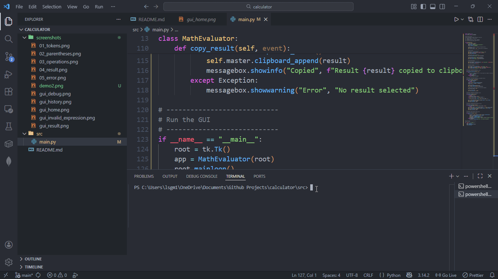

# 🧮 Advanced Python Calculator

A **modern, feature-rich scientific calculator** built with Python and Tkinter. This project demonstrates clean architecture by separating math logic (Engine) from the interface (GUI), robust error handling, and CI/CD integration.

 

---

## ✨ Features

- **Modern Dark UI**: A sleek "Deep Charcoal & Emerald" theme with a flat design.
- **Calculation History**: Displays the previous operation above the result for better context.
- **Scientific Functions**: Supports powers (`^`), factorials (`!`), square roots (`sqrt`), and logarithms (`log`).
- **Memory Management**: Full `M+`, `MR` (Recall), and `MC` (Clear) functionality.
- **Keyboard Support**: Full integration with the keyboard—press `Enter` to calculate and `Esc` to clear.
- **Robust Testing**: Comprehensive unit test suite covering edge cases like division by zero and domain errors.
- **CI/CD Ready**: Automated testing via GitHub Actions on every push.

---

## 🛠️ Tech Stack

- **Python 3**: Core logic and expression evaluation.
- **Tkinter**: GUI framework for the modern interface.
- **Unittest**: Framework for ensuring mathematical accuracy.
- **GitHub Actions**: Automated CI/CD pipeline.

---

## 🚀 Getting Started

### Prerequisites
- Python 3.10 or higher

### Installation & Usage
1. **Clone the repository:**
    git clone 
2. **Run the application:**
    python src/main.py
3. **Run the tests:**
    python -m unittest discover tests

## 📂 Project Structure
calculator/
├── src/
│   └── main.py          # Logic Engine and GUI classes
├── tests/
│   └── test_main.py     # Unit test suite
├── .github/workflows/   # CI/CD configuration
└── .gitignore           # Keeps the repo clean
