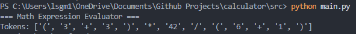
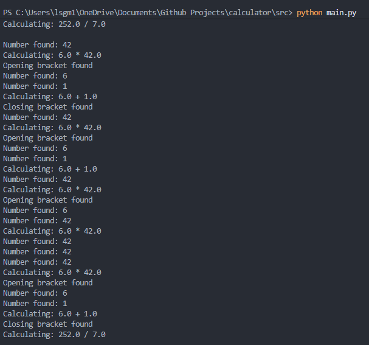
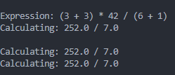
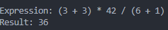
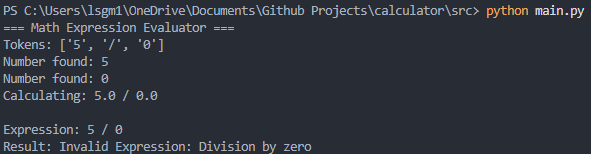

## 📘 Math Expression Evaluator (Python)

A beginner-friendly Python application that evaluates mathematical expressions using recursive descent parsing.

This project is designed not only to calculate results, but also to teach learners how expressions are processed step by step.

## 🚀 Features
Supports basic arithmetic:
Addition (+)
Subtraction (-)
Multiplication (*)
Division (/)
Handles brackets (parentheses)
Supports decimal numbers
Validates user input
Beginner-friendly structure
Well-commented and readable code

## 🎯 Learning Objectives
By studying this project, you will learn how to:
Tokenize user input using regular expressions
Apply order of operations (BODMAS/PEMDAS)
Build a recursive parser in Python
Handle errors gracefully
Write clean and structured code
Think like a problem solver

## 📂 Project Structure
math-expression-evaluator/
│
├── main.py          # Main program
├── evaluator.py     # Expression evaluator logic
├── README.md        # Documentation

## ▶️ How to Run the Program
Requirements:
Python 3.x

### 📸 Debug Mode Demonstration

### 1. Tokenization

### 2. Parsing Parentheses

### 3. Operator Evaluation

### 4. Final Result

### 5. Error Handling (Optional)

## Steps
Clone the repository:
git clone https://github.com/your-username/math-expression-evaluator.git
Navigate into the project folder:
cd math-expression-evaluator

## Run the program:
python main.py

## 🧪 Example Usage
Input
(3 + 3) * 42 / (6 + 1)

Output
Result: 36

## 🖥️ GUI Demo (Tkinter Interface)

This project includes a simple graphical user interface built with Tkinter, allowing users to evaluate mathematical expressions without using the command line.

## ✨ Features
User-friendly input field
One-click evaluation
Optional debug/teaching mode
Real-time result display
Error handling for invalid expressions

## 📸 Screenshots

Below are examples of the application in use:
## 1️⃣ Main Interface
Shows the clean interface when the application is launched.
📁 screenshots/gui_home.png

## 2️⃣ Expression Evaluation
Demonstrates evaluating a valid mathematical expression.
📁 screenshots/gui_result.png

## 3️⃣ Debug / Teaching Mode
Displays step-by-step parsing and evaluation output.
📁 screenshots/gui_debug.png

## ▶️ How to Run the GUI
Make sure Python is installed, then run:
python main.py
The window will open automatically.

## 🧠 Learning Purpose
This GUI was designed to support learning by:
Visualizing how expressions are evaluated
Demonstrating recursive descent parsing
Providing optional debugging output
Helping beginners understand interpreters
It is suitable for students, tutors, and coding facilitators.

## 🧠 How It Works (Simplified Explanation)
The program follows three main steps:
## 1️⃣ Tokenization
The input expression is converted into smaller parts called tokens.

Example:

"3 + 4 * 2"

Becomes:

['3', '+', '4', '*', '2']

This makes the expression easier to process.

## 2️⃣ Parsing
The parser reads tokens using recursive functions:
Function	        Purpose
parse_expression	Handles + and -
parse_term	        Handles * and /
parse_factor	    Handles numbers and brackets

This ensures the correct order of operations is followed.

## 3️⃣ Evaluation
Each part of the expression is calculated step by step until a final result is produced.
Errors are caught and displayed clearly if the expression is invalid.

## ⚠️ Error Handling
The program checks for:
Invalid characters
Incorrect brackets
Unexpected tokens
Division by zero
If an error is found, a helpful message is returned.

## 🚀 Technologies Used
Python 3
Tkinter (GUI)
Regular Expressions (Tokenization)
Recursive Descent Parsing

## 📈 Future Improvements
Dark mode support
Expression history
Keyboard shortcuts
Scientific calculator mode
Mobile-friendly interface

## 💬 Why This Project?

This project was created to help beginners understand how computers interpret and solve mathematical expressions.

It combines problem-solving, logic, and teaching principles in one practical application.

## 👩🏽‍💻 Author

Lesego 
Software Developer & Coding Facilitator

GitHub: https://github.com/lmakweya9
